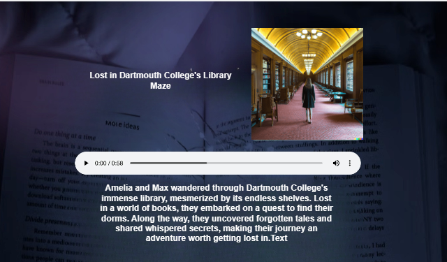

  <h1>📚 Dartmouth Stories</h1> 
An innovative open-source event-driven application that crafts a fresh bedtime tale for your little ones every night. Powered by Lambda, EventBridge, DynamoDB, App Runner, ChatGPT, and DALL-E.
   
    <h3>Key Highlights: Daily unique stories, Enriched with Amazon Polly audio, Enlivened by ChatGPT narratives, and Illuminated with DALL-E imagery — all orchestrated through a meticulously designed event-driven framework.</h3>  
  

# Core Aspects

-   ⏱️ [EventBridge Scheduler](https://aws.amazon.com/blogs/compute/introducing-amazon-eventbridge-scheduler/) for daily bedtime story generation
-   📦 Event-driven architecture leveraging [Amazon EventBridge](https://aws.amazon.com/eventbridge/) to orchestrate the processing of images, audio, and emails.
-   🤖 Fresh, one-of-a-kind stories each night brought to life by [ChatGPT and DALL-E](https://openai.com/blog/chatgpt) for images
-   🧑‍💻 Deployable via [AWS CDK](https://aws.amazon.com/cdk/)

# Operational Overview

1.  Every day, at a predefined time, an [EventBridge Schedule](https://aws.amazon.com/blogs/compute/introducing-amazon-eventbridge-scheduler/) triggers a Lambda function.
    
2.  The `create-story` Lambda function retrieves characters and scenes from [Amazon DynamoDB](https://aws.amazon.com/dynamodb/) tables and employs [ChatGPT](https://openai.com/blog/chatgpt) (OpenAI API) to weave a captivating story. This story is stored in DynamoDB with a 2-day TTL (Time to Live).
    
3.  An [Amazon EventBridge Pipe](https://docs.aws.amazon.com/eventbridge/latest/userguide/eb-pipes.html) is set up to monitor new items created within the table using streams. It subsequently triggers an [Amazon EventBridge event](https://aws.amazon.com/eventbridge/) (StoryCreated).
    
4.  EventBridge directs the `StoryCreated` event to three destinations:
    

-   SNS for email notifications
    -   SNS is utilized to inform the user about the freshly generated story.
-   [AWS Lambda](https://aws.amazon.com/lambda/) function for audio generation
    -   Lambda generates audio content for the story via Amazon Polly. The audio file is then stored in S3 with a signed URL (valid for 2 days).
-   [AWS Lambda](https://aws.amazon.com/lambda/) function for image generation.
    -   This Lambda function crafts an image for the story using DALL-E (OpenAI API). The resulting image is stored in S3 with a signed URL (valid for 2 days).

5.  The frontend application is hosted on [AWS App Runner](https://aws.amazon.com/apprunner/) and runs a NextJS SRR application. When users access the URL via email (through the SNS topic), the story is fetched and displayed.

# Architectural Considerations

This application was conceived as a proof of concept. If you intend to extrapolate its patterns, there are several design considerations to ponder.

This application is geared towards individual use, sending a daily story URL to a single recipient. Scaling to accommodate multiple users necessitates architectural adjustments.

## Frontend Application Hosting

The frontend application, constructed with NextJS, resides in App Runner. The App Runner container is granted permissions to interact with the DynamoDB table to access stories. Stories are automatically purged from the table after 2 days due to TTL settings.

## EventBridge Pub/Sub

Upon story creation, EventBridge emits events to multiple consumers (audio processing, image creation, and SNS), potentially resulting in race conditions. There may be instances where audio or images are not yet available when the user accesses the story. The application checks for the presence of audio and images, reverting to rendering only the story if this data is not yet accessible (owing to asynchronous processing). While this approach suffices for simple use cases, waiting for completion may necessitate exploration of patterns such as aggregators or step function workflows to manage state.

## Three DynamoDB Tables vs. One

The application, being relatively straightforward, utilizes three tables. The characters and scenes table experiences infrequent updates, while the stories table stores the generated stories. Scaling for numerous users demands thoughtful consideration of access patterns and table design.

# Deployment Instructions

## Prerequisites

-   [OpenAI API Key](https://platform.openai.com/overview)
-   Node v16 or higher
-   [AWS CDK](https://aws.amazon.com/cdk/)

## Acquire Your OpenAI API Key and Store It in Secret Manager

Begin by obtaining an OpenAI API key. If you do not possess an account, you must create one. Get started [here](https://platform.openai.com/overview).

Once you have your API key, add it to Secret Manager with the secret name set as `open-api-key`.

## Deploy to Your AWS Account

1.  Clone the repository.
    
2.  Modify the `config.json` file (add your email address and cron job).
    
3.  Execute `npm run install:all`.
    
4.  Run `npm run deploy`:
    
    -   This operation deploys three stacks (Tables, Frontend, Backend) into your AWS account using CDK.
    -   Deployment may take a few minutes to complete (containers need to initialize).
5.  Populate your DynamoDB databases (Scenes and Characters):
    
    -   You can find the files in `/backend/data/`. Customize these files as needed.
    -   Execute `npm run populate-db` to populate these tables.
6.  Once completed, your application is ready.
    

# Crafting a Tale

The EventBridge scheduler triggers your Lambda function to generate a story at the configured time specified in your `config.json` file (default is 7:15 PM).

You can also manually invoke the function (<stage>-aiStoriesBackend-scheduledlambdafunction<id>) for on-demand story generation.
